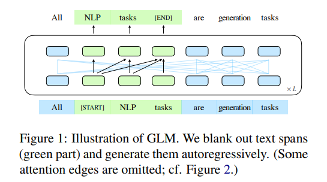
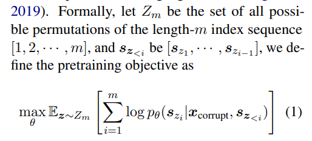
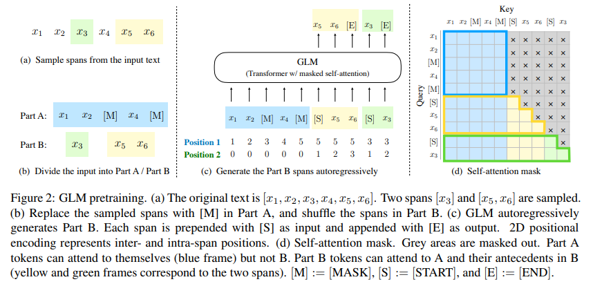

# GLM: General Language Model Pretraining with Autoregressive Blank Infilling

## Abstract

autoencoding models (e.g., BERT), 

autoregressive models (e.g., GPT), 自回归模型 learn left-to-right language models

encoder-decoder models (e.g., T5).

natural language understanding (NLU), 

unconditional generation, 

conditional generation. 

We propose a General Language Model (GLM) based on ==autoregressive blank infilling(自回归空白填充)== to address this challenge

GLM improves blank filling pretraining by adding 2D positional encodings and allowing an arbitrary order to predict spans

GLM can be pretrained for different types of tasks by varying the number and lengths of blanks

## 1. Introduction

*Language models pretrained on unlabeled texts have substantially advanced the state of the art in various NLP tasks, ranging from natural language understanding (NLU) to text generation (Radford et al., 2018a; Devlin et al., 2019; Yang et al., 2019; Radford et al., 2018b; Raffel et al., 2020; Lewis et al., 2019; Brown et al., 2020).*

*In general, existing pretraining frameworks can be categorized into three families: autoregressive, autoencoding, and encoder-decoder models*

**Few-shot learning ability**

Few-shot learning ability 是指机器学习模型在只有很少的标注样本（即“few-shot”）的情况下学习新任务或概念的能力。在传统的机器学习和深度学习中，模型通常需要大量的标注数据来学习和泛化。然而，在许多实际应用中，获取大量标注数据是昂贵或不可行的，这就需要模型能够从很少的样本中快速学习。

Few-shot learning 通常分为三种情况：

1. **One-shot learning**: 模型只有一个标注样本来学习新任务或概念。
2. **Few-shot learning**: 模型有少量的标注样本来学习新任务或概念。
3. **Zero-shot learning**: 模型在没有任何标注样本的情况下，通过转移以前学到的知识来学习新任务或概念。

Few-shot learning 的关键挑战是如何设计模型和学习算法，使其能够有效地利用有限的数据，减少过拟合，同时保持良好的泛化能力。这通常涉及到元学习（meta-learning）或学习如何学习的技术，其中模型学习到的不仅仅是特定任务的解决方案，而是如何快速适应新任务的策略。例如，通过训练模型在多个不同但相关的任务上快速适应，以便当面对一个全新的任务时，即使只有很少的数据，也能够快速学习并作出准确的预测。

近年来，像GPT-3这样的大型预训练语言模型表现出了一定的few-shot learning 能力，即通过在大量文本上预训练，学习到丰富的语言和世界知识，然后在给定少量示例的情况下，就能够对新任务进行预测或生成。

the inherent disadvantage is the ==unidirectional attention mechanism==, which cannot fully capture the dependencies between the context words in NLU tasks. 

Autoencoding models, such as BERT (Devlin et al., 2019), learn bidirectional context encoders via denoising objectives, e.g. Masked Language Model (MLM) —— contextualized representations - NLU tasks —— but not for text generation

1. **Autoencoding models（自编码模型）**：这类模型的设计初衷是学会从输入数据中捕捉到有用的表示（或编码），然后再基于这些表示重构（或解码）出输入数据。在自然语言处理（NLP）的上下文中，这种模型通常被训练来理解文本的内容和结构。
2. **BERT (Devlin et al., 2019)**：BERT是一个具体的自编码模型实例，它通过大量文本数据的预训练学习到了语言的深层次结构和语义信息。BERT特别之处在于它采用了Transformer架构来学习文本中词汇的双向上下文关系，即每个词的表示都是基于其前面和后面的词来决定的。
3. **bidirectional context encoders（双向上下文编码器）**：这里指的是BERT模型的能力，即能够同时考虑给定词语前后文本的信息来生成该词语的上下文相关表示。这种双向上下文理解是BERT区别于以往单向模型的一个关键特性。
4. **denoising objectives（去噪目标）**：在训练自编码模型时，去噪目标是一种常见的策略，即模型需要从有意添加的噪声（例如，遮蔽或替换文本中的某些词）中恢复出原始输入。这种方法迫使模型学习到更加鲁棒和有意义的数据表示。
5. **e.g. Masked Language Model (MLM)（例如，遮蔽语言模型）**：MLM是BERT采用的一种特定的去噪训练目标。具体来说，它随机地从输入文本中遮蔽一部分词语（将它们替换为一个特殊的[MASK]标记），然后要求模型预测这些遮蔽词语的原始形式。通过这种方式，BERT学习到了一个能够理解和表示双向上下文信息的强大语言模型。

Encoder-decoder models adopt bidirectional attention for the encoder, unidirectional attention for the decoder, and cross attention between them.

——conditional generation tasks, such as text summarization and response generation.

Unconditional generation refers to generating text as a language model without finetuning, while conditional generation refers to sequence-to-sequence tasks.

*T5 (Raffel et al., 2020) unifies NLU and conditional generation via encoder-decoder models but requires more parameters to match the performance*

*however, since the autoencoding and autoregressive objectives differ by nature, a simple unification cannot fully inherit the advantages of both frameworks.*

==GLM (General Language Model), based on autoregressive blank infilling==

Randomly blank out continuous spans of tokens from the input text, 

——following the idea of autoencoding,

train the model to sequentially reconstruct the spans

——following the idea of autoregressive pretraining

*While blanking filling has been used in T5 (Raffel et al., 2020) for text-to-text pretraining, we propose two improvements, namely span shuffling and 2D positional encoding. Empirically, we show that with the same amount of parameters and computational cost, GLM significantly outperforms BERT on the SuperGLUE benchmark by a large margin of 4.6% – 5.0% and outperforms RoBERTa and BART when pretrained on a corpus of similar size (158GB).*

==span shuffling== & ==2D positional encoding==

*same amount of parameters and computational cost, GLM significantly outperforms BERT on the SuperGLUE benchmark by a large margin of 4.6% – 5.0% and outperforms RoBERTa and BART when pretrained on a corpus of similar size (158GB).GLM also significantly outperforms T5 on NLU and generation tasks with fewer parameters and data*

*Inspired by Pattern-Exploiting Training (PET) (Schick and Schütze, 2020a), we reformulate NLU tasks as ==manually-crafted cloze questions that mimic human language.==*

* Different from the BERT-based models used by PET, GLM can naturally handle ==multi-token answers== to the ==cloze question== via ==autoregressive blank filling==*

By varying the **number and lengths** of **missing spans**,

the autoregressive blank filling objective can pretrain LMs for **conditional and unconditional generation**.

Through **multi-task** learning of different pretraining objectives,  a single GLM can excel in both NLU and (conditional and unconditional) text generation.

## 2. GLM Pretraining Framework

GLM formulates NLU tasks as cloze questions that contain task descriptions.

### 2.1 Pretraining Objective

#### 2.1.1 Autoregressive Blank Infilling

GLM is trained by optimizing an autoregressive blank infilling objective.

Given an input text $x$:
$$
\mathbf{x} = [x_1,..,x_n]
$$
multiple text spans:
$$
\{\mathbf{s_1},...,\mathbf{s_m}\}
$$
are sampled, where each span $\mathbf{s_i}$ corresponds to  a series of consecutive tokens:
$$
[s_{i,l_1},...,s_{i,l_i}] \ in \ \mathbf{x}
$$
Each span is replaced with a single $[MASK]$ token, forming a corrupted text $\mathbf{x}_{corrupt}$

 The model predicts the missing tokens in the spans from the corrupted text in an autoregressive manner, which means when predicting the missing tokens in a span, the model has access to the **corrupted text*** and the previously predicted spans

To fully capture the **interdependencies** between different spans, we **randomly permute the order** of the spans,

好的，结合文章的内容，这个公式是GLM（General Language Model）的训练目标，它是通过优化一个自回归填充空白的目标（autoregressive blank infilling objective）来训练的。具体来说：

- \( $\theta$ \)：模型的参数。
- \( $E_{z \sim Z_m} $\)：期望值，对所有可能的空白（blank）的排列z进行平均。这里的空白是指文本中随机去除（mask）的片段，它们被模型预测。\( Z_m \)是所有可能的空白排列的集合。
- \($ \sum_{i=1}^{m} $\)：求和符号，对所有的空白进行求和，每个空白都有一个预测的概率。
- \( $\log p_{\theta}(s_{z_i} | x_{\text{corrupt}}, s_{z_{<i}}) $\)：这是模型在参数\( $\theta$ \)下，给定已损坏文本\( $x_{\text{corrupt}} $\)（即某些部分已被遮蔽的文本）和先前预测的空白\( $s_{z_{<i}} $\)，预测当前空白\( $s_{z_i} $\)的对数概率。这个条件概率是自回归的，意味着预测当前空白时会利用到已经预测出来的空白的信息。

模型的训练过程就是寻找最佳的参数\( $\theta$ \)，使得对于所有可能的空白排列，模型能够最大化它们被正确预测出来的对数概率的期望值。简言之，GLM被训练以最大化其在给定部分信息的条件下，预测文本中遮蔽部分的能力。通过这种方式，GLM学习了如何根据上下文来填充缺失的文本部分，这不仅对理解语言有帮助，而且也使得模型能够生成连贯的文本。

The probability of generating the span $s_i$ is factorized as:
$$
p_{\theta}(\mathbf{s_i}|\mathbf{x_{corrupt}}, \mathbf{s_{z_{<i}}}) = \prod^{l_i}_{j=1}p(s_{i,j}|\mathbf{x_{corrupt}},\mathbf{s_{z_{<i}},s_{i,<j}})
$$
在给定一部分已经观察到的信息的条件下，预测一个序列中的下一个元素。这里的自回归模型是指在当前步骤的输出依赖于之前步骤的输出。

计算在损坏文本 $x_{corrupt}$ 和之前预测的遮蔽序列 $s_{<i}$ 的条件下，遮蔽序列 $s_{zi}$ 中第 j 个遮蔽元素的概率。

- $ p_{\theta}(s_{z_i} | x_{\text{corrupt}}, s_{<i}) $：在模型参数 \( $\theta$ \) 下，给定损坏文本 \( $x_{\text{corrupt}} $\) 和之前所有遮蔽序列 \( $s_{<i}$ \) 时，遮蔽序列 \( $s_{z_i}$ \) 的概率。
- $ \prod_{j=1}^{l_i} $：从 1 到 \( $l_i $\) 的索引 j 的所有项相乘。这里的 \($ l_i $\) 是序列 \( $s_{z_i} $\) 的长度。
- $ p(s_{z_i, j} | x_{\text{corrupt}}, s_{<i}, s_{i,<j}) $：这是在给定损坏文本 \( $x_{\text{corrupt}}$ \)、之前的遮蔽序列 \( $s_{<i}$ \)，以及在当前遮蔽序列 \( $s_{z_i} $\) 中之前的元素 \($ s_{i,<j} $\) 的条件下，序列 \($ s_{z_i} $\) 中第 j 个元素的条件概率。

整个公式展示了一种因子分解的方式，它将序列 \( $s_{z_i}$ \) 中元素的联合概率分解为每个元素的条件概率的连乘积。这是自回归模型的特点，它一步步地预测序列，每一步的预测都基于前一步的结果。在语言模型的训练过程中，这种方法使得模型能够根据先前的上下文逐步预测下一个词或字符，从而捕捉文本的结构和连贯性。在GLM中，这种方法用于训练模型预测被遮蔽的词或词组。

The input $\mathbf{x}$ is divided into two parts: 

- Part A is the corrupted text $x_{corrupt}$
- Part B consists of the masked spans.

Part A tokens can attend to each other, but cannot attend to any tokens in B. 

Part B tokens can attend to Part A and antecedents in B, but cannot attend to any subsequent tokens in B.

在GLM模型的上下文中，输入文本被分为两个部分：Part A和Part B。Part A是指已经被损坏的文本（即有一些词被遮蔽或移除），而Part B包含了被遮蔽的词或词组。

具体来说，这句话中的“attend”指的是模型在计算一个词的表示时，可以考虑到哪些其他词的信息。在Transformer模型中，这通过自注意力机制来实现，该机制允许每个词汇基于其他词汇的信息来更新自己的表示。

- **Part B tokens**：指的是那些在Part B中的词，这些词需要模型去预测或生成，因为它们在原始输入中是遮蔽的。
- **and antecedents in B**：“antecedents”指的是在Part B中，当前词之前的所有词。所以，Part B中的一个词在更新自己的表示时，也会考虑到Part B中它之前的词的信息。
- **but cannot attend to any subsequent tokens in B**：这表示Part B中的词在生成自己的表示时，不能考虑到自己后面的词的信息。这是因为在自回归模型中，当前词的预测只能基于之前的词，来防止信息泄露（即在预测一个词时，不应该提前知道后面的词）(decoder)。

Each span is padded with special tokens [START] and [END], for input and output respectively.

The model automatically learns a ==bidirectional encoder (for Part A)==

and a ==unidirectional decoder (for Part B)== in a unified model.