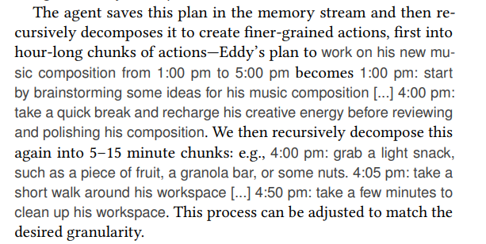

# Generative Agents: Interactive Simulacra of Human Behavior

## abstract

In this work, we demonstrate..., by populating a sandbox environment, reminiscent(缅怀，追忆) of The Sims.

Coordinate group activities.

proxy n.代理

Believable proxies of ... can empower ... ranging from immersive(adj.沉浸式虚拟现实的) environment to rehearsal(n.排练) spaces for interpersonal communication to prototyping(n.原型设计) tools.

In this paper, we introduce... 

They form options, notice each other, and initiate conversations,  they remember and reflect on days past as they plan the next day.

To enable... , we describe an architecture that extends a large language model to store a complete record... synthesize(合成) those memories over time into higher-level reflections, and  retrieve them dynamically to plan behavior.

We instantiate... to populate... inspired by...  where  the end users can interact with...

emergent adj.新兴的，特征突出的

Staring with only a  single user-specified  notion that one agent wants to throw a Valentine's Day party, the agents autonomously(独立自主地) spread invitations to  the party over the next two days, make new acquaintances(相识), ask each other out on dates to the party.

We demonstrate through ablation(消融，一种证明方法) that the components of our agent architecture——observation, planning and reflection——each contribute critically(很大程度上) to the believability of agent behavior.

By fusing(熔化，熔合-> 通过使用)... with...  this word introduces architectural and interaction patterns(交互模式) for enabling believable simulations of human behavior.


## Keywords

CCS CONCEPTS • Human-centered computing→Interactive systems and tools; • Computing methodologies → Natural language processing. 

KEYWORDS Human-AI Interaction, agents, generative AI, large language models

## 1. Introduction

## 3. GA Behavior and Interaction

To make concrete(adj.具体) the affordances(n.功能可见性) of GAs, we instantiate them as characters in a sprite-based sample sandbox world reminiscent of The Sims, evokes a small town environment. 

### Agent Avatar and Communication

NL description including occupation and  relationship with others, as ==seed memories==


Each ==semicolon-delimited(分号分隔的) phrase(短语)== is entered into the agent's initial memory as memories at the start  of the simulation.

#### Inter-Agent Communication

The agents interact with the world by their ==actions==, and with each other through ==NL==.

At each ==time step==, the agents output a ==NL statement describing their current action==. This statement is then ==translated into concrete movements== and  displayed on  the interface as ==a set of emojis==. 

*A language model that translates the action into a set of emojis, which appear above each avatar in a speech bubble. The full NL can be accessed by clicking on the  avatar.*

Agents communicate with each other in full NL. A GA architecture determines whether they walk by or engage in conversation.

**We note that the conversational style of these agents can feel overly formal, likely a result of instruction tuning in the underlying models. **

#### User Controls

Can steer(v.引导) the simulation and intervene(n.干涉), either by ==conversation==, or by issuing a directive to an agent in the form of an =='inner voice'==.

The user communicates with the agent through natural language, by specifying a persona that the agent should perceive them as.

Navigating its map

Users can also enter the sandbox world of Smallville as an agent operating with in it.

Users and agents can influence the state of the objects, a bed can be occupied(占用) when an agent is sleeping.

A refrigerator can be empty when an agent uses up the ingredients to make breakfast.

Users can input a command to the system that chooses the object and illustrates its new status, like this:"<Isabella's apartment: kitchen: stove> is burning."


Starting from the single-paragraph description, agents begin plan their days. As time passes in the sandbox world, their behaviors evolve as these agents interact with each other and the world, build memories and relationships, and coordinate joint activities.

By tracing the output of our system over the course of one day for the agent.

Eddy follows suit, rushing out of bed...


#### Emergent(新兴的，突出的) Social Behaviors

Extending prior work, these social behaviors are emergent rather than pre-programmed.

```reStructuredText
[79] Joon Sung Park, Lindsay Popowski, Carrie J. Cai, Meredith Ringel Morris, Percy
Liang, and Michael S. Bernstein. 2022. Social Simulacra: Creating Populated
Prototypes for Social Computing Systems. In In the 35th Annual ACM Symposium
on User Interface Software and Technology (UIST ’22) (Bend, OR, USA) (UIST ’22).
Association for Computing Machinery, New York, NY, USA. https://doi.org/10.
1145/3526113.3545616
```

##### Information Diffusion

##### Relationship memory

##### Coordination


## 4. GA Architecture

engage in interactions

react to changes in the environment

A novel agent architecture that combines a LLM with mechanisms for synthesizing and retrieving relevant information to condition(约束) the language model's output on.

may not make important inferences, and may not maintain long-term coherence(连贯性，条理性).

Challenges with long-term planning and coherence remain even with today's most performant(adj计算机. 性能好的) models such as GPT-4.

```
[18] Sébastien Bubeck, Varun Chandrasekaran, Ronen Eldan, Johannes Gehrke, Eric
Horvitz, Ece Kamar, Peter Lee, Yin Tat Lee, Yuanzhi Li, Scott Lundberg, et al.
2023. Sparks of artificial general intelligence: Early experiments with gpt-4.
arXiv preprint arXiv:2303.12712 (2023).
```

Records are recursively synthesized into higher-  and higher-level  observations that guide behavior.

allowing the architecture to leverage a LLM.


==Different types of memory==

### 4.1 Memory and Retrieval

memory stream——a list of memory objects, where each object contains a natural language description,  a  creation time-stamp and a most recent  access time-stamp.

The most basic element of the  memory stream is an observation, (themselves, other agents, non-agent objects)


$$
Retrieval \ function(agent's \ current \ situation)  = subset \ of \  the \ memory \ stream 
\\
=> language \ model
$$
There are many possible implementations of a retrieval function, depending on what it is important that the agent consider when deciding how to act.

EX:

#### Recency

Recency assigns a higher score to memory objects that were  recently accessed.

An exponential decay function over the number of sandbox game hours since the memory was last retrieved. Delay factor is 0.99.

#### Importance

Importance distinguishes mundane from core memories, by assigning a higher score to those memory objects that the agent believes to be important.

directly asking the language model to output an integer score is effective. 


This prompt returns an integer value of 2 for “cleaning up the room” and 8 for “asking your crush out on a date.” The importance score is generated at the time the memory object is created

#### Relevance

A higher  score to memory objects that are related to the current situation.

On a query memory.

Use language model to generate an ==embedding vector== of the text description of each memory. Then calculate relevance as the ==cosine similarity== between the ==memory's embedding vector== and the ==query memory's embedding vector==.

==Final retrieval score:== normalize the recency, relevance, and importance scores to the range of [0,1] by min-max scaling.
$$
score = \alpha_{recency} · recency \ + \ \alpha_{importance} · importance \ + \  \alpha_{relevance} · relevance
$$
The top-ranked memories that fit in the language models context window are then included in the prompt.

### 4.2 Reflection

#### Challenge

When equipped with only raw observational memory, GAs struggle to generalize or make inferences. (But often bad performance, better to make an initialization or boundary)


#### Approach:

Second type of memory: reflection.

Reflections are higher-level, more abstract thoughts generated by the agent.

EX:  Generate reflection when the ==sum of the importance scores== for the latest events perceived by the agents exceeds a ==certain threshold==. In practice, agents reflected roughly two or three times a day.

##### First step

Determine what to reflect on, by identifying questions that can be asked given the agent's recent experiences.

Query the LLM with the 100 most recent records in the memory stream, and prompt: "Given only the information above, what are 3 most salient(突出的) high-level questions we can answer about the subjects in the statements?"

Use these generated questions as queries for retrieval, and gather relevant memories (including other reflections) for each question. 

Then prompt the language model to extract insights and cite the particular records that served as evidence for the insights. 


Klaus Mueller is dedicated to his research on gentrification(because of 1,2,8,15).

Parse and store the statement as a reflection in the memory stream, including pointers to the memory objects that were cited.

Reflection explicitly allows the agents to reflect not only on their observations but also on other reflections——==tree of reflections==: the leaf nodes of the tree represent the base observations, and the non-leaf nodes represent thoughts that become more abstract and higher-level higher up the tree they are.(注意这是个反向收敛树，作者可能想的是由于不断有新的observation，用叶子节点方便维护，直接并查集，同时避免过度发散)

### 4.3 Planning and Reacting

#### Challenge:

While a LLM can generate plausible behavior in response to situational information, agents need to plan over a longer time horizon to ensure that their sequence of actions is coherent and believable.

```
[45] John J. Horton. 2023. Large Language Models as Simulated Economic Agents:
What Can We Learn from Homo Silicus? arXiv:2301.07543 [econ.GN]

[79] Joon Sung Park, Lindsay Popowski, Carrie J. Cai, Meredith Ringel Morris, Percy
Liang, and Michael S. Bernstein. 2022. Social Simulacra: Creating Populated
Prototypes for Social Computing Systems. In In the 35th Annual ACM Symposium
on User Interface Software and Technology (UIST ’22) (Bend, OR, USA) (UIST ’22).
Association for Computing Machinery, New York, NY, USA. https://doi.org/10.
1145/3526113.3545616
```

Optimizing for believability in the moment sacrifices believability over time. To overcome this issue, planning is essential.

#### Approach

Plans describe a future sequence of actions, each plan includes a location, a starting time, and a  duration.

 An entry in a plan might state, for example: for 180 minutes from 9am, February 12th, 2023, at Oak Hill College Dorm: Klaus Mueller’s room: desk, read and take notes for research paper. Like reflections, plans are stored in the memory stream and are included in the retrieval process. This allows the agent to consider observations, reflections, and plans all together when deciding how to behave. Agents may change their plans midstream if needed.

The first step is to create a plan that outlines the day's agenda in broad strokes(大致轮廓).

To create the initial plan, prompt LLM with the agent's summary description(e.g., name, traits, and summary of their recent experiences) and a summary of their previous day.




#### 4.3.1 Reacting and Updating Plans

```c
action loop{
	perceive observations 
	-> memory stream 
	-> LLM -> whether(existing plan) ? continue : (react->re-plan)
	conditioning utterances(summerized memory, intended reaction)
        -> generates dialogue
    
	
}
```

a dynamically-generated, paragraph-long summary of the agent’s overall goals and disposition


*The context summary is generated through two prompts that retrieve memories via the queries “What is [observer]’s relationship with the [observed entity]?” and “[Observed entity] is [action status of the observed entity]”, and their answers summarized together. The output suggests that John could consider asking Eddy about his music composition project.*

Then regenerate the agent's existing plan starting from the time when the reaction takes place.

#### 4.3.2 Dialogue


The result: “Hey Eddy, how’s the music composition project for your class coming along?” From Eddy’s perspective, John initiating the dialogue is seen as an event to which he may want to react.

From Eddy’s perspective, John initiating the dialogue is seen as an event to which he may want to react. So, just as John did, Eddy retrieves and summarizes his memory about his relationship with John, as well as his memory that may be related to John’s last utterance in the dialogue. If he decides to respond, we generate Eddy’s utterance using his summarized memory and the current dialogue history:


This generates Eddy’s response: “Hey Dad, it’s going well. I’ve been taking walks around the garden to clear my head and get some inspiration.” The continuation of this dialogue is generated using the same mechanism until one of the two agents decides to end the dialogue.

## 5. Sandbox Environment  Implementation

==Phaser web game development framework==

```
[56] Phaser Labs. no date provided. Welcome to Phaser 3. https://phaser.io/phaser3.
Accessed on: 2023-04-03.
```

The server maintains a JSON data structure that contains information about each agent in the sandbox world, including their current location, a description of their current action, and the sandbox object they are interacting with.

At each sandbox time step, the sandbox server parses the JSON for any changes coming from the generative agents, moves the agents to their new positions, and updates the status of any sandbox objects that the agents are interacting with (e.g., changing the status of the coffee machine from “idle” to “brewing coffee” if an agent’s action is “making espresso for a customer @ Hobbs Cafe: counter: coffee machine”)

The agent’s output action then updates the JSON, and the process loops for the next time step.

split this semicolon-delimited list of characteristics up into a set of memories. These serve as the initial memories that determine the agent’s behavior

### 5.1 From Structured World Environments to Natural Language, And Back Again

sandbox environment—areas and objects—as a ==tree data structure==, with ==an edge in the tree indicating a containment relationship in the sandbox world==

Agents build individual tree representations of the environment as they navigate it — subgraphs of the overall sandbox environment tree


## 6. Controlled evaluation

### Evaluation Procedure

==believability==

```
[9] Joseph Bates. 1994. The Role of Emotion in Believable Agents. Commun. ACM
37, 7 (1994), 122–125. https://doi.org/10.1145/176789.176803
```

Interview agents to probe their ability

The interview include five question categories: maintaining self-knowledge, retrieving memory, generating plans, reacting, and reflecting.


within-subjects design内部参照设计：一种实验设计方法，其中每个参与者都接受所有处理条件，以便在不同条件下比较他们的表现。

The study was a within-subjects design, where 100 participants compared interview responses generated by four different agent architectures and a human author condition for the same agent. The experiment displayed one randomly chosen question from each of the five question categories, along with the agent’s responses generated from each condition. The evaluators ranked the believability of all of the conditions from most to least believable.

### 6.2 Conditions

Three ablated architectures: *(no observation, no reflection, no planning), (NR, NP), (NR)*

The (NO, ,NR, NP) condition represents the previous SOTA for agents created through LLM.

```
[11] Marcel Binz and Eric Schulz. 2023. Using cognitive psychology to understand GPT-3. Proceedings of the National Academy of Sciences 120, 6 (2023),
e2218523120.

[45] John J. Horton. 2023. Large Language Models as Simulated Economic Agents:
What Can We Learn from Homo Silicus? arXiv:2301.07543 [econ.GN]

[79] Joon Sung Park, Lindsay Popowski, Carrie J. Cai, Meredith Ringel Morris, Percy
Liang, and Michael S. Bernstein. 2022. Social Simulacra: Creating Populated
Prototypes for Social Computing Systems. In In the 35th Annual ACM Symposium
on User Interface Software and Technology (UIST ’22) (Bend, OR, USA) (UIST ’22).
Association for Computing Machinery, New York, NY, USA. https://doi.org/10.
1145/3526113.3545616
```

Architectures were given equivalent access to all memories accrued by the agent up until the moment of the interview. 

The differences observed here are likely to represent a conservative estimate of the true differences: in reality the ablated architectures would not have followed the same path as the full architecture through the two day simulation. We chose to design the experiment this way as re-simulating for each architecture would cause the simulations to diverge into different states, making comparison challenging.

In addition to the ablation conditions, we added a human crowd-worker roleplay condition that is intended to provide a human baseline. We do not intend this baseline to capture maximal human expert performance: instead, we aim to use this condition to identify whether the architecture passes a basic level of behavioral competency, so that we are not just comparing ablations to each other with no behavioral grounding

We recruited a unique worker for each of the 25 agents and tasked them with watching a replay of that agent’s sandbox life and inspecting its memory stream. We then asked the worker to roleplay and author responses to the interview questions in the voice of the agent whose replay they watched. To ensure that the human-authored responses met at least a baseline expectation in quality, the first author manually inspected the workers’ responses to the question “Describe your typical weekday schedule in broad strokes” to confirm that the responses were written in coherent sentences and in the voice of the agent. Four sets of human-generated responses did not meet these criteria and were re-generated by other workers.